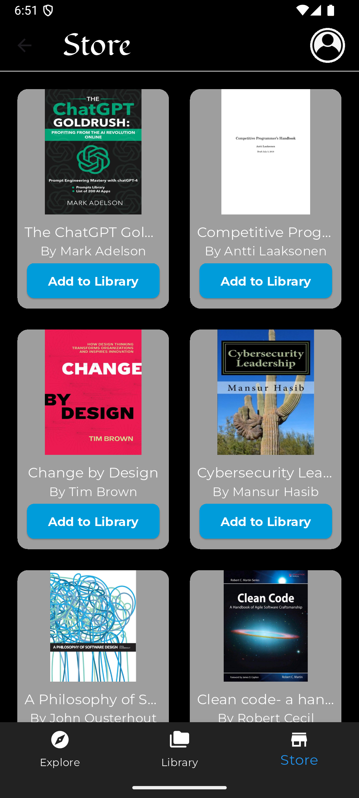
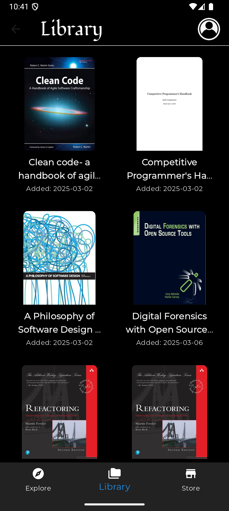
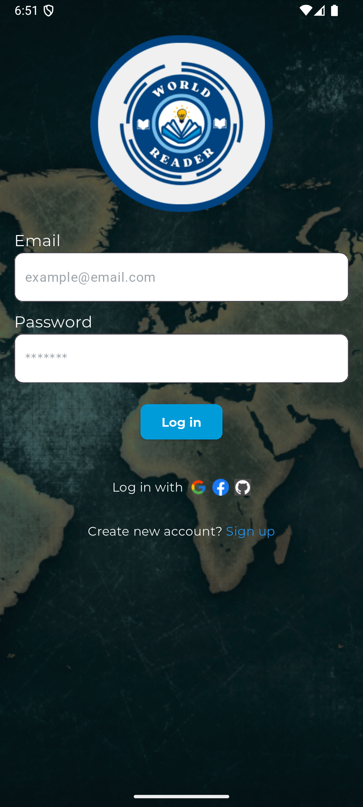
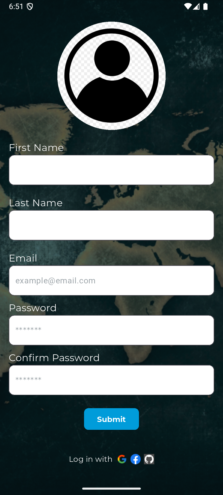

# WorldReader

[Demo Video](https://www.youtube.com.com/your-demo-video-link)

## Features

- **On Boarding Page:** Welcome users with a showcase of key features—Library, Store, and World Map.
- **Store Page:** Browse and add books from a diverse global catalog, with verified author indicators.
- **Library Page:** Curate and manage personal book collections, search, sort, and remove books.
- **Map Page:** Explore a heatmap of book origins worldwide, showing where stories come from.
- **Profile Management:** Update personal details, manage account settings, and upload books.
- **Authentication:** Log in or register to access personalized features, with social login options.

## Technologies Used

- **Flutter:**
- **Backend:** Node.js/Express, MongoDB for data storage.
- **Other:**

# Screenshots

## On Boarding Screen

## Store Page

## Library Page

## Map Page

## Login Page

## Sign Up Page

